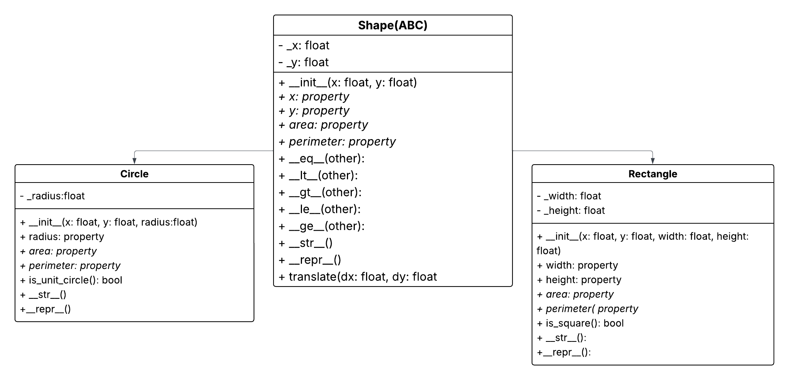

Absolut\! Här är ett försök att skriva om din README så att den låter mer som en personlig sammanfattning av ett projekt och mindre som en formell, AI-genererad rapport.

Jag har behållit all viktig information men ändrat tonen, språket och strukturen.

-----

# Lab 2 - Geometri-klasser i Python

Det här projektet är en uppsättning klasser för att hantera geometriska former i Python. Det började med 2D-former (`Circle`, `Rectangle`) som bygger på en abstrakt `Shape`-klass. Senare utökades det med 3D-former (`Cube`, `Sphere`) som fristående klasser.

Projektet innehåller också enhetstester med `pytest` och en `Shape2DPlotter`-klass som använder Matplotlib för att rita upp 2D-formerna.

## UML Diagram (2D-hierarkin)


*(Notera: UML-diagrammet visar bara 2D-klasserna. 3D-klasserna och plottern är medvetet separerade från denna arvshierarki.)*

## Klasserna

  * **`Shape` (shape.py):** En abstrakt basklass (ABC). Den definierar vad alla 2D-former måste ha: en position (`x`, `y`), en `translate`-metod och abstrakta properties för `area` och `perimeter`. Den hanterar också all jämförelselogik (som `<`, `>`, `==`).
  * **`Rectangle` (rectangle.py):** Ärver från `Shape`. Lägger till `width` och `height`. Beräknar `area`, `perimeter` och har en extra property `is_square`.
  * **`Circle` (circle.py):** Ärver från `Shape`. Lägger till `radius`. Beräknar `area`, `perimeter` och har en extra property `is_unit_circle`.
  * **`Cube` (cube.py):** En fristående klass. Har en `side` och beräknar `volume`, `surface_area` och total kantlängd (`perimeter`).
  * **`Sphere` (sphere.py):** En fristående klass. Har en `radius` och beräknar `volume`, `surface_area` och `circumference` (omkretsen av storcirkeln).
  * **`Shape2DPlotter` (shape2dplotter.py):** En fristående klass som använder Matplotlib. Den har en `add_shape()`-metod för att lägga till 2D-former och en `show_plot()`-metod för att visa resultatet.

## Designval & Struktur

Ett viktigt beslut var att **separera 2D- och 3D-formerna**. `Cube` och `Sphere` ärver inte från `Shape` eftersom de inte är "former" på samma sätt. En kub har `volume`, inte `perimeter` på samma sätt som en 2D-form. Att tvinga in dem i samma hierarki hade blivit stökigt.

Jag **separerade också rit-logiken**. Mina form-klasser (`Circle`, `Rectangle`) innehåller *ingen* Matplotlib-kod. De vet bara hur man är en form. En separat `Shape2DPlotter`-klass sköter allt som har med ritande att göra. Det gör koden mycket renare och enklare att underhålla.

All validering (t.ex. att en radie inte kan vara negativ) görs i **property setters** (`@property.setter`). Det gör att ett objekt aldrig kan ha ett ogiltigt värde. Den gemensamma valideringskoden finns i `utils.py` för att undvika att upprepa kod.

## Tester

Projektet använder `pytest` för enhetstester. Testerna kollar att:

  * Objekt skapas korrekt.
  * Beräkningar för `area`, `volume`, etc. stämmer.
  * Felhantering fungerar (t.ex. att `ValueError` kastar som det ska för negativa tal).
  * Flyttalsjämförelser görs säkert med `math.isclose`.

Du kan köra testerna från rotmappen med kommandot:

```bash
pytest
```

## Köra koden

Du kan köra de flesta filer direkt för att se exempel. De två mest intressanta är:

**1. Köra 3D-beräkningar (t.ex. `sphere.py`):**

```bash
python sphere.py
```

```
Please enter the radius of the sphere: 5
The volume of the sphere is: 523.59877...
The surface area of the sphere is: 314.15926...
```

**2. Köra 2D-plottern (`shape2dplotter.py`):**

```bash
python shape2dplotter.py
```

Detta öppnar ett Matplotlib-fönster som ritar upp de former som är definierade i `if __name__ == "__main__"`-blocket i filen.

## Filstruktur

```
lab_2/
├── README.md
├── shape.py           # 2D Abstrakt basklass
├── rectangle.py       # 2D Rektangel
├── circle.py          # 2D Cirkel
├── cube.py            # 3D Kub (Fristående)
├── sphere.py          # 3D Sfär (Fristående)
├── utils.py           # Delad valideringsfunktion
├── shape2dplotter.py  # Matplotlib-visualisering
├── test_cube.py       # Pytest-tester för Kub
├── test_sphere.py     # Pytest-tester för Sfär
└── Uml_lab2.png       # UML-diagram (endast 2D)
```

## Student

Rickard Garnau